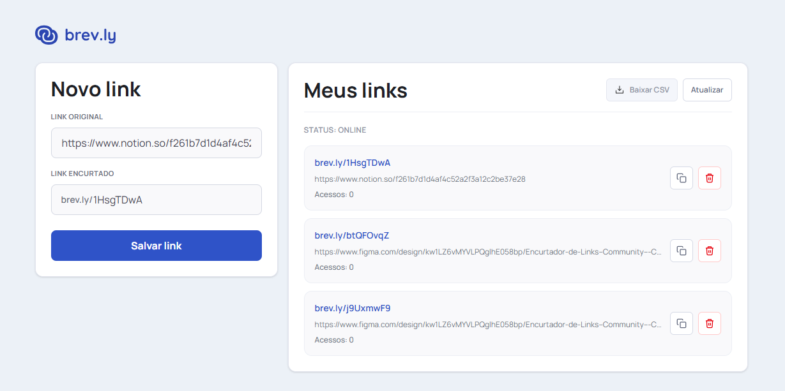

# brevly-web

Aplicação web para encurtamento de URLs. Permite criar links curtos e personalizados, com rastreamento de cliques e gerenciamento de links encurtados através de uma interface intuitiva.

## 📸 Preview



## 🚀 Tecnologias Utilizadas

- **React** - Biblioteca JavaScript para construção de interfaces
- **TypeScript** - Superset do JavaScript com tipagem estática
- **Tailwind CSS** - Framework CSS utilitário
- **Node.js** - Runtime JavaScript

## 🛠️ Como Usar

```bash
pnpm install
pnpm run dev
```
## 📋 Requisitos

- **Node.js** (v18 ou superior)
- **pnpm** - Gerenciador de pacotes rápido
- **Docker** - Para containerização
- **PostgreSQL** - Banco de dados relacional

## 🔧 Stack Completo

- **Next.js** - Framework React com SSR e otimizações
- **Prisma** - ORM para gerenciamento de banco de dados
- **Cloudflare** - CDN e edge computing
- **PostgreSQL** - Banco de dados principal
- **Docker** - Containerização da aplicação
- **pnpm** - Gerenciador de pacotes eficiente

## 🚀 Instalação e Execução

```bash
pnpm install
pnpm  run dev
```

Certifique-se de configurar as variáveis de ambiente (`.env.local`) com as credenciais do PostgreSQL e Cloudflare antes de executar.

## 🌐 Deployment

- **Vercel** - Plataforma de deploy para aplicações Next.js
- **AWS ECR** - Registro de contêineres para armazenar imagens Docker
- **AWS S3** - Serviço de armazenamento de objetos em nuvem

## 📝 Licença

MIT# brevly-web
